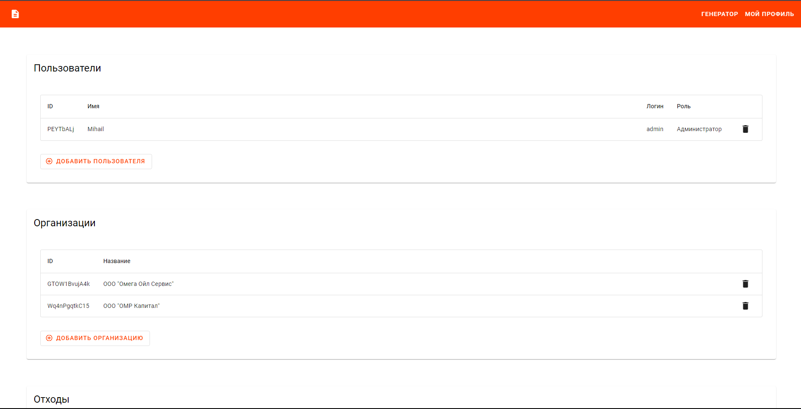

# Offer Builder

## Description

Offer Builder is an open-source tool for creating commercial offers, which is currently being utilized internally by [OMR Capital](https://omrcapital.ru/).

The project has been published to showcase my coding skills and serve as a reference for future projects. Please note that as a real-world business tool under active development, some parts of the code might be temporarily suboptimal due to time constraints. I plan to allocate time to address these issues in the future.

Additionally, this project can serve as a reference for running full-stack applications on the [Deta Space](https://deta.space/) platform.

## Demo and Deployment

### Demo

You can install your own instance from [Discovery](https://deta.space/discovery/r/qtinn3ezemoduasx). After installing, you will need to set up an admin password and API tokens in the `Settings` section from the Canvas.

### Deployment

To deploy your own instance of the project to the Deta Space platform, follow these steps:

1. Install `Space CLI` by following [these instructions](https://deta.space/docs/en/build/fundamentals/space-cli).

2. Install `Poetry` by following [these instructions](https://python-poetry.org/docs/#installation).

3. Clone this repository.

4. Create a project in Deta Space (see [these instructions](https://deta.space/docs/en/build/fundamentals/development/builder)).

5. Link the project to the local repository (see [these instructions](https://deta.space/docs/en/build/fundamentals/development/projects#project-linking)).

6. Run `./scripts/space-push.bat` or `./scripts/space-dev` from the project root directory.

## Stack

The project is built on the [Deta Space](https://deta.space/) platform, which determines the choice of database, file storage, and serverless architecture.

### Backend

- Python
- [FastAPI](https://fastapi.tiangolo.com/)
- [Deta Base](https://deta.space/docs/en/build/reference/http-api/base) - NoSQL database provided by Deta
- [ODetaM](https://github.com/rickh94/ODetaM) - ORM for Deta Base. I am actively involved in the development of this library.
- [Deta Drive](https://deta.space/docs/en/build/reference/http-api/drive) - file storage provided by Deta

### Frontend

- TypeScript
- [Svelte](https://svelte.dev/)
- [SvelteKit](https://kit.svelte.dev/)
- [SMUI](https://sveltematerialui.com) - Svelte Material UI components

## License

MIT License
